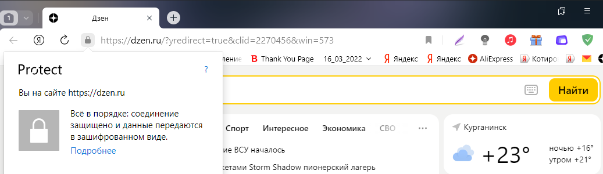
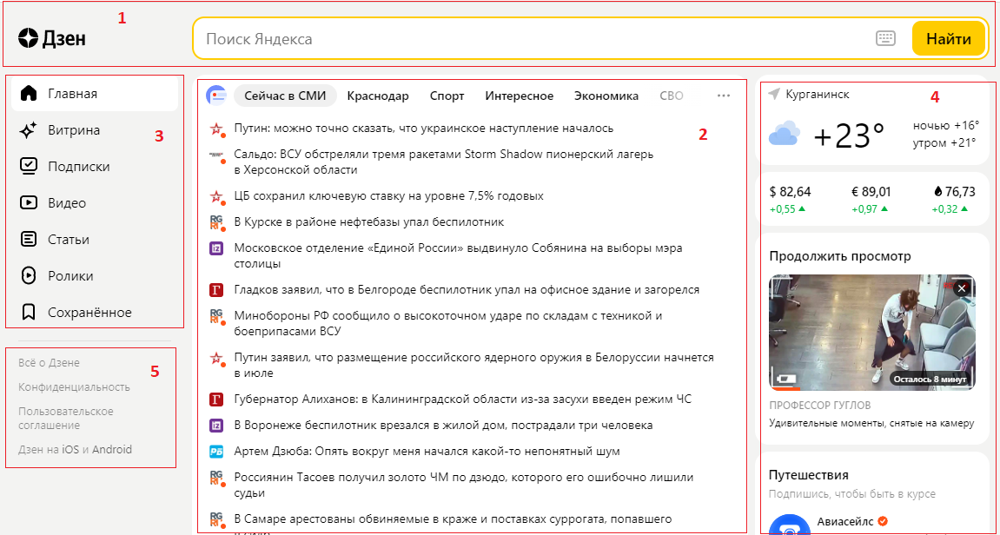
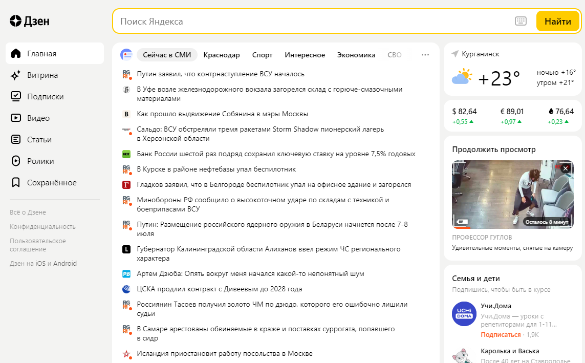
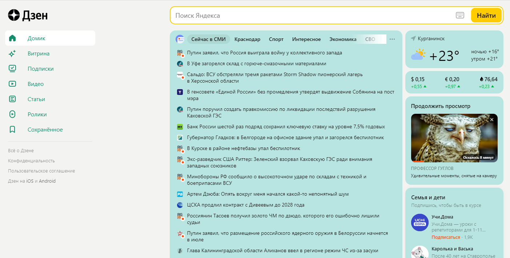
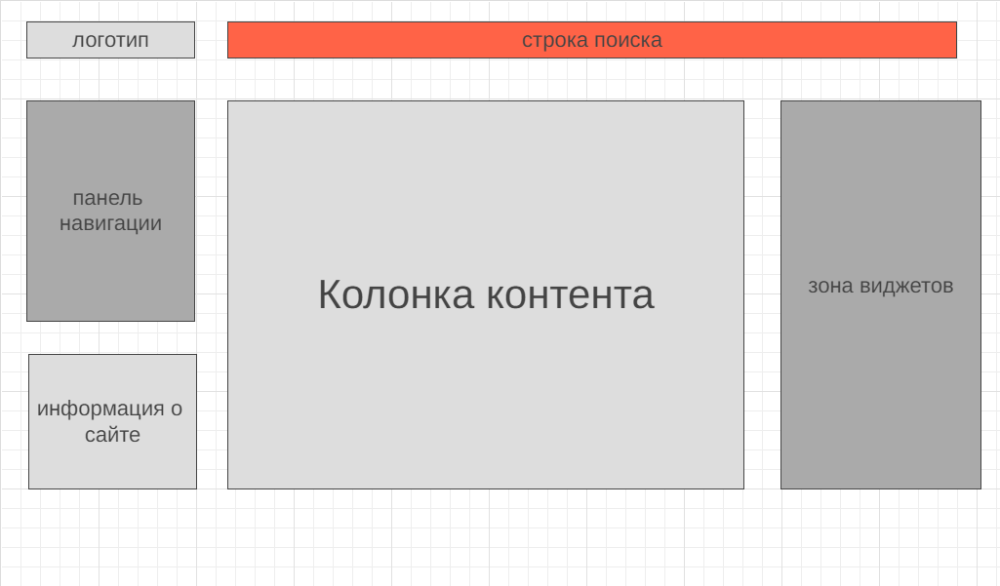

##Промежуточная аттестация

###Задача: на основе сайта yandex.ru:
**- Определите, на каком протоколе работает сайт.**
**- Проанализируйте структуру страницы сайта.**
**- Внесите не менее 10 изменений на страницу с помощью инструмента разработчика и представьте скриншоты было/стало.**
**- Задание по желанию необязательное - Создайте прототип низкой детализации (дополнительное задание, если на семинаре дошли до задания №8).**

1. Как видно из рисунка сайт yndex.ru использует HTTPS-протокол( безопасная версия протокола HTTP)

2. На рисунке ниже цифрами обозначены:

 1 - шапка
 2 - зона контента
 3 - навигация
 4 - зона виджетов
 5 - подвал

3. Ниже на скриншотах представлены оригинальная и измененная главная страница сайта yandex.ru 

4. Прототип низкой детализации
